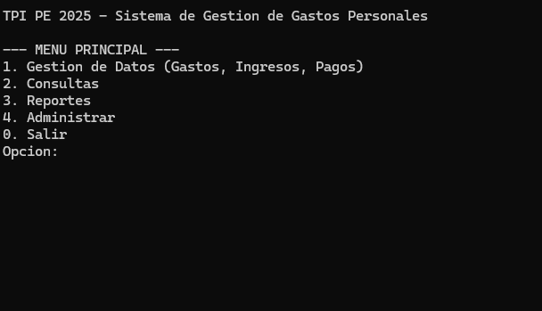
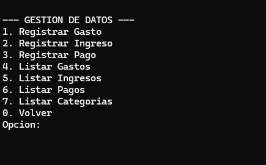
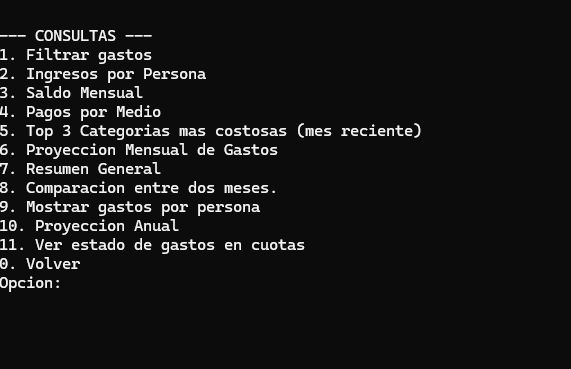
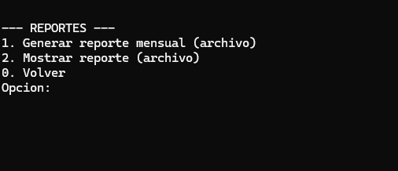
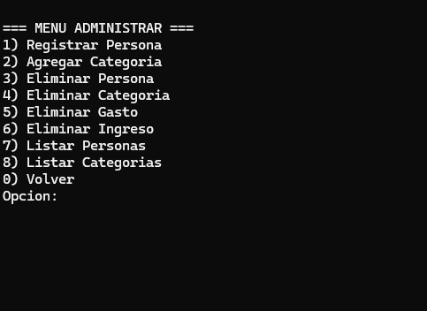

# Sistema de Gestión de Gastos Personales (TPI PE 2025)

Este repositorio contiene el código fuente del Trabajo Práctico Integrador (TPI) de la materia Programación Estructurada (Año 2025) de la Universidad Gastón Dachary.

El proyecto es una aplicación de consola desarrollada en C para la gestión de finanzas personales o familiares, permitiendo un control detallado de ingresos, gastos, pagos y proyecciones.

## 📜 Descripción del Proyecto

El objetivo de este software es permitir a un grupo de personas (como una familia) registrar y organizar sus ingresos y gastos mensuales. El sistema permite tener un control claro de la economía, identificar en qué se destina el dinero, quién realiza cada gasto y calcular balances para tomar mejores decisiones financieras.

El programa persiste todos los datos en archivos binarios (`.dat`) y es capaz de generar reportes en archivos de texto (`.txt`).

### ✨ Funcionalidades Principales

El sistema se organiza en torno a un menú principal que da acceso a cuatro módulos:

1.  **Gestión de Datos:**
    * **Registrar Gastos:** Permite registrar gastos de diferentes tipos:
        * **Fijos** (ej. alquiler, internet).
        * **Ocasionales** (ej. salidas, compras puntuales).
        * **Temporales** (ej. compras en cuotas, indicando total y cuotas pagadas).
        * **Anuales** (ej. matrícula, seguros).
    * **Registrar Ingresos:** Asocia un ingreso a una persona, con concepto, fecha y monto.
    * **Registrar Pagos:** Asocia un pago a un gasto existente, actualizando su estado (Pendiente, Pagado Parcialmente, Pagado) y registrando el medio de pago.
    * **Listados:** Muestra todos los gastos, ingresos, pagos y categorías registrados.

2.  **Consultas y Reportes:**
    * Filtrar gastos por Categoría.
    * Filtrar gastos por Mes y Año.
    * Mostrar ingresos por Persona.
    * Calcular el Saldo Mensual (Ingresos vs. Gastos).
    * Mostrar gastos con cuotas Pendientes.
    * Filtrar pagos por Medio de Pago (efectivo, débito, etc.).
    * Listar gastos con Saldo Incompleto.
    * Ver el Top 3 categorías más costosas del último mes.
    * Calcular una Proyección Mensual de gastos (promedio últimos 3 meses).
    * Mostrar un Resumen General histórico (totales y promedios).
    * Comparativo intermensual de gastos (totales y variación).
    * Análisis de distribución de gastos por persona (porcentaje y rubro).
    * Proyección anual de saldo (próximos 12 meses).
    * Historial de un gasto temporal (detalle de cuotas).

3.  **Reportes:**
    * Permite generar un **reporte mensual en archivo de texto** (ej. `resumen_enero_2025.txt`) con el detalle de todos los movimientos del período seleccionado.

4.  **Administrar:**
    * **Gestión de Personas:** Registrar nuevas personas (miembros de la familia) y eliminarlas (baja lógica o *soft delete*).
    * **Gestión de Categorías:** Agregar y eliminar categorías de gastos personalizadas.
    * **Eliminación de Registros:** Permite dar de baja (lógica) gastos e ingresos.

---

## 🛠️ Aspectos Técnicos

* **Lenguaje:** C (Estándar C99).
* **Paradigma:** Programación Estructurada.
* **Persistencia:** Uso de archivos binarios (`.dat`) para el almacenamiento de registros (Gastos, Ingresos, Pagos, Personas, Categorías).
* **Estructuras:** Uso intensivo de `struct` para modelar las entidades (`Gasto`, `Ingreso`, `Pago`, `Categoria`, `Persona`) y `typedef`.
* **Manejo de Memoria:** Carga de datos maestros (como categorías y personas) en arrays estáticos al inicio del programa para eficiencia en las consultas.
* **Modularidad:** El código está separado en:
    * `estructuras.h`: Definición de todos los `struct`.
    * `funciones.h`: Prototipos e implementación de toda la lógica del programa (menús, validaciones, operaciones de archivos, etc.).
    * `main.c`: Punto de entrada que inicializa y llama al menú principal.
* **Interfaz:** Gráficos de consola utilizando la biblioteca `windows.h` (`gotoxy`, `setColor`, `Sleep`) para una mejor experiencia de usuario (pantalla de carga, transiciones, etc.).

---

## ⚙️ Requisitos Previos

* Sistema Operativo Windows (10 u 11) debido al uso de `windows.h` para la interfaz.
* Un compilador de C (como MinGW/TDM-GCC, incluido en Dev-C++, o el compilador de Visual Studio).

---

## 🚀 Cómo Compilar y Ejecutar

El proyecto está diseñado para ser compilado fácilmente en entornos de desarrollo C para Windows.

### Opción 1: Embarcadero Dev-C++ (Recomendado)

Esta es la forma más sencilla de compilar el proyecto, ya que es un IDE ligero que incluye el compilador MinGW.

* **Link de Descarga:** [**Embarcadero Dev-C++ (Sitio Oficial)**](https://www.embarcadero.com/es/free-tools/dev-cpp/free-download)

**Instrucciones:**

1.  Descarga e instala Dev-C++ desde el enlace anterior.
2.  Abre el IDE.
3.  Crea un nuevo proyecto: **Archivo > Nuevo > Proyecto**.
4.  Selecciona **"Console Application"** y asegúrate de elegir **"C Project"** (Proyecto C). Dale un nombre al proyecto.
5.  En el explorador de proyectos (panel izquierdo), verás un `main.c`. Reemplaza el contenido de ese archivo con el código de tu `main.c`.
6.  Copia los archivos `funciones.h` y `estructuras.h` en la misma carpeta donde guardaste tu proyecto (donde está el `main.c`).
7.  ¡Eso es todo! El IDE detectará los archivos.
8.  Presiona **F11** (o ve a **Ejecutar > Compilar y Ejecutar**). El programa se compilará y se abrirá la consola.

### Opción 2: Visual Studio 2019 / 2022

Visual Studio es un IDE más complejo, pero también totalmente compatible si se configura correctamente.

**Instrucciones:**

1.  Asegúrate de tener Visual Studio instalado con la carga de trabajo **"Desarrollo de escritorio con C++"**.
2.  Abre Visual Studio y selecciona **"Crear un proyecto"**.
3.  Busca y selecciona la plantilla **"Aplicación de consola" (Console App)**. Asegúrate de que sea la de C++.
4.  Nombra tu proyecto y créalo.
5.  En el **Explorador de soluciones** (panel derecho), verás un archivo fuente llamado `TuProyecto.cpp`. **Haz clic derecho sobre él y cambia el nombre a `main.c`**. (Cambiar la extensión de `.cpp` a `.c` es crucial para que VS use el compilador de C).
6.  Reemplaza todo el contenido de `main.c` con el código de tu archivo `main.c`.
7.  Añade los otros archivos: Haz clic derecho en el nombre del proyecto en el Explorador de soluciones, selecciona **"Agregar" > "Elemento existente..."** y selecciona tus archivos `funciones.h` y `estructuras.h`.
8.  **¡Paso Importante!** Visual Studio considera "inseguras" algunas funciones estándar de C (como `sscanf`). Para permitir que el código compile, debes hacer lo siguiente:
    * Haz clic derecho en el nombre del proyecto (en el Explorador de soluciones) y selecciona **"Propiedades"**.
    * Ve a **Propiedades de configuración > C/C++ > Preprocesador**.
    * En el campo **"Definiciones de preprocesador"**, haz clic en la flecha, selecciona **"<Editar...>"**.
    * Añade la siguiente línea en el cuadro: `_CRT_SECURE_NO_WARNINGS`
    * Haz clic en "Aceptar" en ambas ventanas.
9.  Ahora, presiona **Ctrl + F5** (o el botón verde "Iniciar") para compilar y ejecutar el programa.

---

## 📋 Modo de Uso y Archivos Generados

Al ejecutar el programa, serás recibido por una pantalla de carga animada y luego por el menú principal.

--- MENU PRINCIPAL ---

Gestion de Datos (Gastos, Ingresos, Pagos)

Consultas

Reportes

Administrar

Salir Opcion:

* **Navegación:** Simplemente ingresa el número de la opción que deseas y presiona Enter.
* **Validaciones:** El sistema valida todas las entradas (números, textos, fechas) para prevenir errores.

### Archivos Generados

El programa crea y gestiona automáticamente los siguientes archivos en la misma carpeta donde se encuentra el ejecutable:

* **`gastos.dat`**: Archivo binario que almacena todos los registros de gastos.
* **`ingresos.dat`**: Archivo binario con los registros de ingresos.
* **`pagos.dat`**: Archivo binario con todos los pagos realizados.
* **`personas.dat`**: Archivo binario que guarda los usuarios o miembros de la familia.
* **`categorias.dat`**: Archivo binario con las categorías de gastos.
* **`resumen_[mes]_[año].txt`**: (Ej. `resumen_noviembre_2025.txt`) Archivos de texto generados desde el menú "Reportes", que contienen un resumen legible de los movimientos de ese mes.

---

## 📸 Capturas de Pantalla

---

## 👨‍💻 Autores

Este proyecto fue desarrollado por:

* **Godoy, Tomas**
* **Martinez, Mariana Priscila**
* **Moreno, Francisco**
* **Scheuermann, Renata**

## 📄 Licencia

Este proyecto se distribuye bajo la Licencia MIT.
